# logcaster
A podcast creation engine underpinned by a logseq knowledge graph and multi agent framework

# Automated Daily News Podcast Generation

This project aims to develop a sophisticated toolchain using FastAPI and OpenWebUI to automate the creation of a daily news podcast. The goal is to seamlessly integrate various modules and pipelines to process breaking news items, rank their importance, generate structured content, and ultimately produce a compelling podcast featuring two interlocutors, Bob and Sue.

## Workflow Overview

**Loading Topics**: Search the logseq knowledge graph for the tagged public pages. Create a list of any pages above 100kb in size. (execute in logseq python)
**User Elects Topics**: Present a streamlit interface to the user through an iframe hosted in logseq. User selects their topics of choice from the public pages via radio buttons. This selection is stored as a logseq page.
**Randomly Select Topics**: Streamlit app has a "generate podcast" action button. When this is pressed the streamlit script selects 2 or 3 (at random) topics from the list of radio button active public pages.
**Searching for News**: Use Perplexity calls on a cron job to search for breaking news items (surfaced as news in the past 5 days) that intersect with the loaded topics.
**Ranking Importance**: Evaluate the returned news item using a locally hosted Mixtral 8B Language Model (LLM), score on likely impact and public interest on a scale from 1 to 10.
**Branching facttor**: IF the news item scores over 8 then pass the Perplexity-generated content to GPT-4 if not then select another 2 or 3 public tagged topics and repeat. Execute a maximum of 10 times. if 10 attemtps do not surface a news item of worth then alert the user through the streamlit app.
**Or Progress News Item**: Use GPT4 through 
**Detailed Information Scraping**: Process the identified links using a web scraper module to fetch in-depth summaries and additional content from the linked pages.
**Generating Podcast Script**: Use Claude 3.5, along with the RAGflow corpus and the newly acquired detailed summaries, to craft a compelling podcast script. The script should alternate dialogue between Bob and Sue, incorporating brief mentions of the web sources available in the episode notes.
**Splitting Script**: Divide the podcast script into parts for Bob and Sue, designating each line for one of the interlocutors.
**Text to Voice Conversion**: Pass both scripts to text-to-voice engines to generate the audio for Bob and Sue's lines respectively.
**Synchronization with Metahuman**: Synchronize the generated audio tracks with Metahuman talking heads in Unreal Engine to create a lifelike rendering of the podcast episode.

## Workflow Diagram

```mermaid
graph TD
    A[Load Topics from File] --> B[Search for News Items with Perplexity]
    B --> C[Rank News Items with Mixtral 8B LLM]
    C --> D{Is Score ≥ 8?}
    D -- Yes --> E[Restructure News with GPT-4 and Isolate Links]
    E --> F[Scrape Detailed Information from Links]
    F --> G[Generate Podcast Script with Claude 3.5]
    G --> H[Split Script for Bob and Sue]
    H --> I[Convert Text to Voice for Bob and Sue]
    I --> J[Sync Audio with Metahuman in Unreal Engine]

    D -- No --> K[Discard Item]
```

## Implementation Details

The toolchain will be orchestrated by a Python script that interacts with the filesystem and calls the necessary APIs. The script will be modular, with each task encapsulated in its own function, and will include robust logging, configuration management, state management, unit tests, and documentation.

### Main Functions

1. `load_topics()`: Reads a list of topics from a file.
2. `search_news_items(topics)`: Uses Perplexity to search for news items related to the given topics.
3. `rank_news_items(items)`: Uses Mixtral 8B LLM to rank the news items, returning a list of items with a score from 1 to 10.
4. `process_high_score_items(items)`: Filters items with scores above 8, uses GPT-4 to restructure the items into technical essays, and isolates web links.
5. `scrape_details(links)`: Uses a web scraper module to fetch detailed summaries from the links.
6. `create_podcast_script(story, summaries)`: Uses Claude 3.5 and RAGflow corpus to create a podcast script.
7. `split_script(script)`: Splits the script between two interlocutors: Bob and Sue.
8. `text_to_voice(lines, person)`: Uses text-to-voice engines to convert lines into audio for Bob and Sue.
9. `sync_with_metahuman(bob_audio, sue_audio)`: Syncs the audio with Metahuman talking heads over a network connection to Unreal Engine.

## Next Steps

1. Implement the Python script with the outlined functions and best practices.
2. Set up the necessary APIs and modules (FastAPI, OpenWebUI, Perplexity, Mixtral 8B LLM, GPT-4, Claude 3.5, RAGflow, web scraper, text-to-voice engines, Metahuman, Unreal Engine).
3. Test and refine the toolchain, ensuring smooth integration and reliable performance.
4. Document the setup, usage, and maintenance of the toolchain for future reference and collaboration.

By following this plan, we can develop a robust and efficient toolchain for automating the creation of daily news podcasts, delivering engaging and informative content to our audience.
