# logcaster
A podcast creation engine underpinned by a logseq knowledge graph and multi agent framework

# Automated Daily News Podcast Generation

This project aims to develop a sophisticated toolchain using FastAPI and OpenWebUI to automate the creation of a daily news podcast. The goal is to seamlessly integrate various modules and pipelines to process breaking news items, selecting only for interesting and unusual combinations of thing. The system will then generate structured content through a multi agent approach, mediated by a single API interface, and ultimately produce a compelling podcast featuring two interlocutors, Bob and Sue.

## Workflow Overview

**A logseq executed python block parses the current logseq markdown page to find the IP address of the openwebui server which will be in the form - OpenWebUI IP Address = xxx.xxx.xxx.xxx
**Request the model list from the openwebui api on http://192.168.0.51
**List is returned into a logseq block in the current markdown file which is labelled ## Models Available as an indented list
**Select Agent Models** The user can copy paste model names into the agent slots in the markdown page which are labelled ### role of agent then ```text user copied their choice heer``` 
**Loading Topics**: Search the logseq knowledge graph for the tagged public pages. Create a list of any pages above 100kb in size. (execute in logseq python)
**User Elects Topics**: Present the public list to the user in a logseq block, as line seperated topics. User selects their topics of choice from the public pages via simple deletion of unimportant aspect. This selection then remains stored in the logseq page which is the execution environment.
**Randomly Select Topics**: The next block of execuatble logseq code, when exedcuted, selects 2 or 3 (at random) topics from the list of radio button active public pages. The code overwrites the content of the logseq block which starts ### Trying these topics - topic 1 - topic 2 - topic 3 on their own indented lines
**Searching for News**: The same code block then called the perplexity pipeline which is available in the model list above, using the openwebui unified API, to search for breaking news items (surfaced as news in the past 5 days) that intersect with 2 or three randomly loaded topics.
**Ranking Importance**: Evaluate the returned news item using a locally hosted Mixtral 8B Language Model (LLM), called from the list of available models. Request a score on likely impact and public interest on a scale from 1 to 10.
**Branching facttor**: IF the news item scores over 8 then pass the Perplexity-generated content to GPT-4 if not then select another 2 or 3 public tagged topics and repeat. Execute a maximum of 10 times. if 10 attemtps do not surface a news item of worth then alert the user through the streamlit app.
**Extract web links**: Create a simple list of raw urls found in the perlexity response, and remove duplicates. 
**Detailed Information Scraping**: Process the identified links using the web scraper module in the models list from openwebui, to fetch in-depth summaries and additional content from the linked pages.
**Or Progress News Item**: Use GPT4oV model from the models list, through the openwebui API, sending the raw perplexity response, all of the ancilliary summaries gathered from the web scraper.  Returns from GPT4oV should be a detailed and highly technical description of the news item into json format, with the web urls and their summaries carefully segmented and linked as a knowledge graph in the json structure using linkedJson.
**Send the text elements of the GPT4 generated json to the ragflow module in the models list, requesting that the knowledge be modfied to include any opinions and ideas from the RAG corpus which intersect with the news item. Save the response from this call to logseq block in the current page which is headed # Story Plus RAG
**Generating Podcast Script**: Use Claude 3.5, send the few shot examples of podcast chat from the logseq page labelled [[example podcast dialogue]] along with the RAGflow optimised news story, and all of the json structured web links and their summaries. Request to craft a compelling podcast script. The script should alternate dialogue between Bob and Sue, incorporating brief mentions of the web sources available in the episode notes. The returned json from Claude 3.5 should have field identifiers for bob and sue. 
**Splitting Script**: Divide the podcast script into parts for Bob and Sue, creative two new json files which have sequence numbers for the conversation.
**Text to Voice Conversion**: Pass both scripts to text-to-voice engines to generate the audio for Bob and Sue's lines respectively. Insist that the audio be returned with the sequence numbers.
**Inline python code block creates wav file": The json is parsed to recombine the returned audio elements, rendering a new single wav file.
**Synchronization with Metahuman**: Synchronize the generated audio tracks with Metahuman talking heads in Unreal Engine to create a lifelike rendering of the podcast episode.

## Workflow Diagram

```mermaid
graph TD
    A[Load Topics from File] --> B[Search for News Items with Perplexity]
    B --> C[Rank News Items with Mixtral 8B LLM]
    C --> D{Is Score ≥ 8?}
    D -- Yes --> E[Restructure News with GPT-4 and Isolate Links]
    E --> F[Scrape Detailed Information from Links]
    F --> G[Generate Podcast Script with Claude 3.5]
    G --> H[Split Script for Bob and Sue]
    H --> I[Convert Text to Voice for Bob and Sue]
    I --> J[Sync Audio with Metahuman in Unreal Engine]

    D -- No --> K[Discard Item]
```



## Implementation Details

The toolchain will be orchestrated by a Python script that interacts with the filesystem and calls the necessary APIs. The script will be modular, with each task encapsulated in its own function, and will include robust logging, configuration management, state management, unit tests, and documentation.

### Main Functions

1. `load_topics()`: Reads a list of topics from a file.
2. `search_news_items(topics)`: Uses Perplexity to search for news items related to the given topics.
3. `rank_news_items(items)`: Uses Mixtral 8B LLM to rank the news items, returning a list of items with a score from 1 to 10.
4. `process_high_score_items(items)`: Filters items with scores above 8, uses GPT-4 to restructure the items into technical essays, and isolates web links.
5. `scrape_details(links)`: Uses a web scraper module to fetch detailed summaries from the links.
6. `create_podcast_script(story, summaries)`: Uses Claude 3.5 and RAGflow corpus to create a podcast script.
7. `split_script(script)`: Splits the script between two interlocutors: Bob and Sue.
8. `text_to_voice(lines, person)`: Uses text-to-voice engines to convert lines into audio for Bob and Sue.
9. `sync_with_metahuman(bob_audio, sue_audio)`: Syncs the audio with Metahuman talking heads over a network connection to Unreal Engine.

## Next Steps

1. Implement the Python script with the outlined functions and best practices.
2. Set up the necessary APIs and modules (FastAPI, OpenWebUI, Perplexity, Mixtral 8B LLM, GPT-4, Claude 3.5, RAGflow, web scraper, text-to-voice engines, Metahuman, Unreal Engine).
3. Test and refine the toolchain, ensuring smooth integration and reliable performance.
4. Document the setup, usage, and maintenance of the toolchain for future reference and collaboration.

By following this plan, we can develop a robust and efficient toolchain for automating the creation of daily news podcasts, delivering engaging and informative content to our audience.
